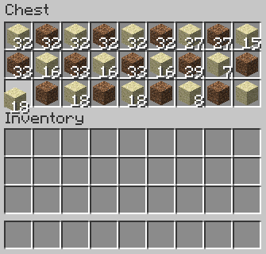
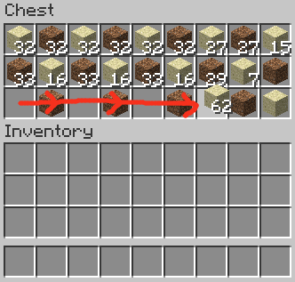

(view on GitHub)

# Extra Mods

These mods are essentially quality-of-life mods.

## Appleskin

When you're hungry and you hold up food in your hand, you can see how much that specific food item will fill up your hunger bar. It will also show you the saturation it gives you. When you eat it, the saturation will be shown and will show you when it's decreasing.\
If you're damaged, this mod will also show you how much this food item will heal you.

## Iris

Compatible with Sodium. This mod allows you to use shaders! :D

## Mod Menu

This mod does exactly what it sounds like. This mod scans all your mods in the "mods" folder and simply shows you a list of all the mods you have installed. You can also go to the mod page via this mod menu to update the mod if there's a new version available.

## MouseTweaks

Ever had the feeling you wanted to have a quicker inventory management system with your mouse? Well, this mod provides you with all sorts of nice features for your mouse to use in the inventory, chests, crafting tables,... You can also choose to enable / disable each individual tweak.

### Tweaks

- You can hold your RMB to drag items in your inventory, mostly used in crafting tables. If you drag over a slot multiple times without releasing your RMB, you start stacking items into that slot according to how many times you've dragged over this slot.
- If you selected an item in your inventory / chest / ..., you can hold your LMB to pick up all the items of the same type.\
  For example: if you want to pick up all items of the same type in a chest like this:\
  \
  you simply hold your LMB and drag it over all the items of the same type.\
  
- Of course, we all know shift-clicking quickly moves the item you selected to your inventory. With this tweak, you can hold you shift key, hold your LMB and drag over all the items in a chest to move all of them quickly to your inventory, instead of having to click on each individual item slot.
- If you have an item stacked in your inventory / chest, you can use your scroll wheel to place items in the other inventory type. Scrolling down causes the item to be moved to the other inventory and scrolling up causes the items to be moved to the inventory where your mouse is at the point of scrolling. It also can be the other way around, if you customize the setting yourself.
