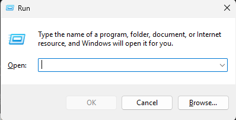

(view on GitHub)

# Resource packs

### Step 1: Open AppData

Press Win+R on your keyboard. You will see a "Run" window appear like this:\
\
\
Type "%appdata%" and press Enter or click "OK". This should open your file explorer in the AppData\Roaming folder. If it opens in AppData, move forward into the Roaming folder.

### Step 2: Resource packs folder

Go into your "resourcepacks" folder and paste the folders in there. **Resource packs should not be unzipped.**
