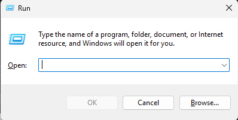

(view in GitHub)

# Minecraft Mods

I do not claim to own or have worked on any of these mods myself. I simply collected them from Modrinth and I'm not responsible for any mistakes you make during the installation of any of these mods. I will provide a step-by-step guide on how to install them. You will only be able to follow this if your Minecraft is installed in the default folders, on _Windows_. If this is not the case, I assume you don't even need this guide.

If you came here from a discord server (only posting it to one server, so if you did, you should know), please only pay attention to the 1.21.4 folder, since the server runs on this version. Running minecraft on a different version will only be causing you to not be able to connect to the server.

## Installation

### Step 1: Open AppData

Press Win+R on your keyboard. You will see a "Run" window appear like this:\
\
\
Type "%appdata%" and press Enter or click "OK". This should open your file explorer in the AppData\Roaming folder. If it opens in AppData, move forward into the Roaming folder.

## Step 2: Minecraft Mods folder

In the AppData\Roaming folder, you should be able to locate the ".minecraft" folder. Open it, and check if you have a "mods" folder. If you have this folder, along with a ".fabric" folder, go directly to _step 4_.\
**WARNING:** You might have a "mods" folder, along with a different mod loader folder installed. The mods in all of these folders will only work with the Fabric mod loader. In this case you still have to follow _step 3_, or you look up the mods for your preferred mod loader. If you don't have any of these folders, you still have to install fabric.

## Step 3: Install Fabric

### Again, only follow this step if you **DON'T** have the "mods" and ".fabric" folders.

Go to the [Fabric download page](https://fabricmc.net/) and download the Fabric installer. Once downloaded, make sure you don't have Minecraft or the Minecraft Launcher running. Then run the installer and select the correct version. The version of your Fabric installation should be 1.21.4 for our server. Install Fabric and open Minecraft Launcher to check if there is a new installation available to run the game. Now to create the mod folder, launch the game on the Fabric installation and close it again.

# Step 4: Install the mods

This is the most simple step. Just copy all the mods that are in the folder and paste them into AppData\Roaming\\.minecraft\mods. Once this is done, launch the game and see if it works! :D

### Sidenote

In each type of folder there will be a file briefly explaining the additional mods, so you can decide which ones you want to use or not. Of course, you can also mix the files for yourself if you want ;).
