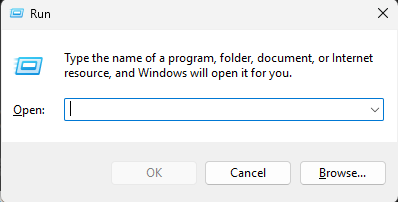

# Shaders

### Make sure you've started up your game with Iris and Sodium installed first, so the necessary folders are created automatically.

### Step 1: Open AppData

Press Win+R on your keyboard. You will see a "Run" window appear like this:\
\
\
Type "%appdata%" and press Enter or click "OK". This should open your file explorer in the AppData\Roaming folder. If it opens in AppData, move forward into the Roaming folder.

### Step 2: Shaders folder

Go into the "shaderpacks" folder and paste the folders in there. **DO NOT UNZIP THEM**
